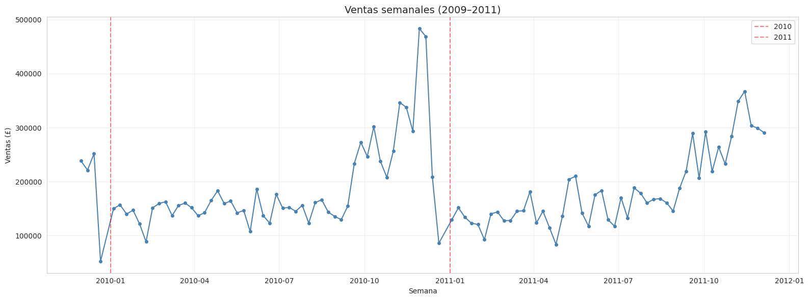
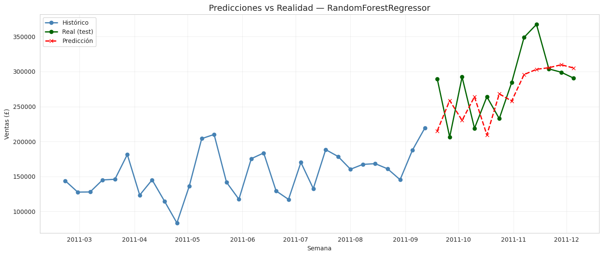
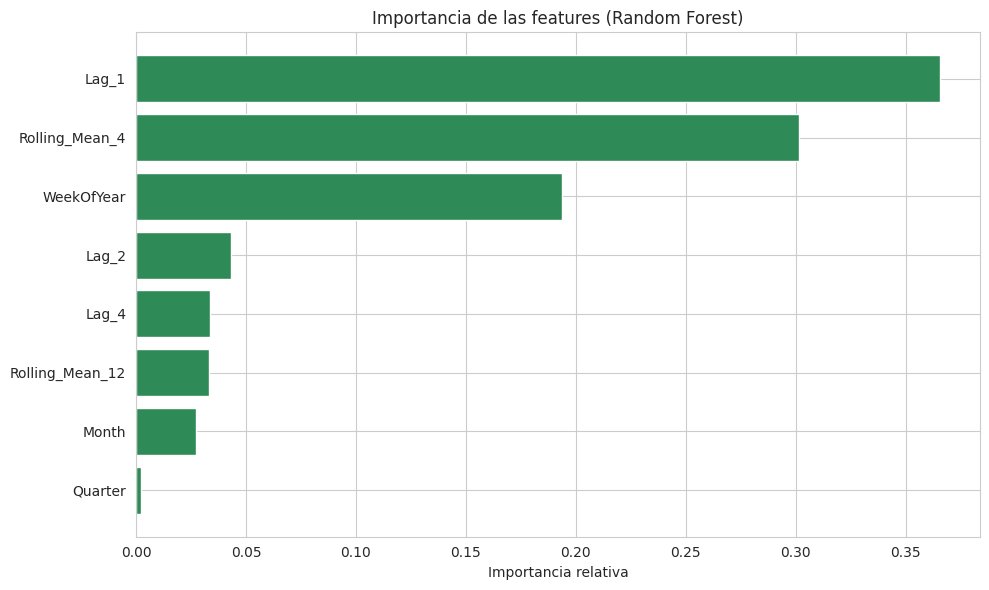
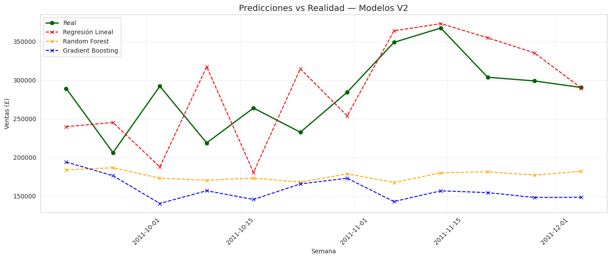

# 🔮 Predicción de Ventas con IA — Mercado de las Especias

[](https://www.python.org/)
[](https://scikit-learn.org/)
[](https://pandas.pydata.org/)
[](https://numpy.org/)
[](https://matplotlib.org/)
[](https://seaborn.pydata.org/)
[](LICENSE)
[]()

> Proyecto de **inteligencia artificial** para predecir las ventas semanales del **Mercado de las Especias** de la isla de Dataclysm, utilizando datos históricos reales y modelos de machine learning.

---

## 📌 Descripción del proyecto

Este proyecto aplica técnicas de **inteligencia artificial** para construir un **modelo predictivo de ventas** basado en datos históricos de una tienda online británica (2009–2011).

El objetivo es proporcionar a los mercaderes una herramienta que les permita:

- **Anticipar la demanda** de sus productos.
- **Planificar el stock** en períodos clave (campaña navideña).
- **Ajustar estrategias comerciales** frente a la incertidumbre del mercado.

---

## 🎯 Objetivos

1. **Recolectar** un dataset histórico relevante para el negocio.
2. **Preparar** los datos: limpieza, agregación y creación de features.
3. **Entrenar** varios modelos de predicción.
4. **Evaluar** con métricas RMSE, MAE y R².
5. **Generar predicciones** para planificar el negocio.

---

## 🏆 Resultados principales

| Métrica | Valor |
|---|---|
| **Modelo seleccionado** | Random Forest (100 árboles, profundidad 8) |
| **RMSE** | 46.810 £ |
| **MAE** | 41.178 £ |
| **R²** | −0,04 |
| **Mejora vs baseline** | **40%** |
| **Error en campaña navideña** | **< 5%** |

**Conclusión clave**: el modelo es **especialmente fiable durante la campaña navideña**, cuando las ventas se triplican y la previsión es más crítica.

---

## 📊 Metodología aplicada

El proyecto sigue los **5 pasos oficiales del reto**:

### Paso 1 — Recolección de datos

- Dataset **Online Retail II** (UCI Machine Learning Repository).
- **995.416 transacciones** reales (2009–2011).

### Paso 2 — Preparación de datos

- **Agregación semanal**: 104 semanas.
- **Creación de features**:
  - **Temporales**: `Month`, `WeekOfYear`, `Quarter`.
  - **Lags**: `Lag_1`, `Lag_2`, `Lag_4`.
  - **Medias móviles**: `Rolling_Mean_4`, `Rolling_Mean_12`.

### Paso 3 — Selección y entrenamiento

Se evaluaron **3 modelos**:

- **Regresión Lineal**: baseline interpretable.
- **Árbol de Decisión**: `max_depth=5`.
- **Random Forest**: `n_estimators=100`, `max_depth=8` → **Seleccionado**.

### Paso 4 — Evaluación

| Modelo | RMSE (£) | MAE (£) | R² |
|---|---:|---:|---:|
| Regresión Lineal | 50.684 | 42.202 | −0,22 |
| Árbol de Decisión | 59.731 | 51.416 | −0,70 |
| **Random Forest** 🏆 | **46.811** | **41.179** | **−0,04** |

### Paso 5 — Predicciones

Predicciones para las **últimas 12 semanas** (sept–dic 2011), comparadas con valores reales.

---

## 📁 Estructura del repositorio

```
Reto4_Prediccion_Ventas/
│
├── datos/
│   └── online_retail_completo.csv          # Dataset origen
│
├── notebooks/
│   └── Reto4_JuditGiravent_Script.py       # Script principal
│
├── salidas/
│   ├── Predicciones_Reto4_JuditGiravent.csv
│   ├── comparativa_baselines.csv
│   ├── comparativa_modelos.csv
│   ├── ventas_semanales_preparadas.csv
│   └── figuras/
│       ├── 01_ventas_semanales.png
│       ├── 02_predicciones_vs_realidad.png
│       ├── 03_importancia_features.png
│       └── 04_predicciones_v2.png
│
├── docs/
│   ├── Informe_Reto4_JuditGiravent.pdf
│   └── Presentacion_Reto4.pptx
│
├── LICENSE
├── .gitignore
└── README.md
```

> **Nota**: si los archivos aún tienen "Reto2" en el nombre, ajústalos según la sección siguiente.

---

## 📈 Visualizaciones destacadas

### Serie temporal completa



### Predicciones vs realidad



### Importancia de las features



### Predicciones (versión 2)



---

## 💡 Recomendaciones de negocio

Basándonos en los resultados del modelo:

1. **Planificación navideña**: aumentar stock un **80–100%** entre octubre y diciembre.
2. **Reducir costes en enero-febrero**: las ventas caen un **60% post-Navidad**.
3. **Reentrenar cada 6 meses** con datos actualizados.
4. **Ampliar el historial a más de 3 años** para mejorar la precisión interanual.
5. **Incorporar variables externas** (promociones, meteorología, eventos).

---

## 🛠️ Tecnologías utilizadas

<p align="center">
  
  
  
  
  
  
</p>

| Herramienta | Uso |
|---|---|
| **Python 3.13** | Lenguaje principal |
| **pandas 3.0.5** | Manipulación de datos |
| **NumPy** | Operaciones numéricas |
| **scikit-learn** | Modelos de ML y métricas |
| **Matplotlib 3.11.2** | Visualizaciones |
| **Seaborn 0.13.2** | Visualizaciones estadísticas |
| **Google Colab** | Entorno de desarrollo |

---

## 🚀 Cómo ejecutar el proyecto

### 1. Clonar el repositorio

```bash
git clone https://github.com/jdthgp27/Reto4_Prediccion_Ventas.git
cd Reto4_Prediccion_Ventas
```

### 2. Instalar dependencias

```bash
pip install pandas numpy scikit-learn matplotlib seaborn
```

### 3. Ejecutar el script

```bash
cd notebooks
python Reto4_JuditGiravent_Script.py
```

Los resultados se guardan automáticamente en `salidas/`.

---

## 📄 Documentación

| Documento | Enlace |
|---|---|
| 📘 **Informe completo (PDF)** | [Ver informe](docs/Informe_Reto4_JuditGiravent.pdf) |
| 🎤 **Presentación ejecutiva (PPTX)** | [Ver presentación](docs/Presentacion_Reto4.pptx) |
| 📊 **Predicciones generadas (CSV)** | [Ver predicciones](salidas/Predicciones_Reto4_JuditGiravent.csv) |
| 📈 **Comparativa de modelos** | [Ver comparativa](salidas/comparativa_modelos.csv) |
| 📉 **Comparativa de baselines** | [Ver baselines](salidas/comparativa_baselines.csv) |

---

## 🎯 Entregables del proyecto

- [x] **Código completo** → `notebooks/Reto4_JuditGiravent_Script.py`
- [x] **Informe del modelo** → `docs/Informe_Reto4_JuditGiravent.pdf`
- [x] **Dataset de predicciones** → `salidas/Predicciones_Reto4_JuditGiravent.csv`
- [x] **Presentación ejecutiva** → `docs/Presentacion_Reto4.pptx`

---

## 🔄 Próximas mejoras

- [ ] Probar modelos avanzados: **SARIMA, Prophet o LSTM**
- [ ] Enriquecer el dataset con más años o variables externas
- [ ] Implementar un pipeline automatizado de reentrenamiento
- [ ] Crear un dashboard interactivo en Power BI con las predicciones

---

## 🤝 Contribuciones

Las contribuciones son bienvenidas:

1. Haz un fork del repositorio.
2. Crea una rama: `git checkout -b feature/nueva-mejora`.
3. Commit: `git commit -m "Añade nueva funcionalidad"`.
4. Push: `git push origin feature/nueva-mejora`.
5. Abre un Pull Request.

---

## 📜 Licencia

Este proyecto está bajo la **Licencia MIT**. Consulta el archivo [LICENSE](LICENSE) para más detalles.

---

## 👤 Autora

**Judit Giravent Pineda**

- GitHub: [@jdthgp27](https://github.com/jdthgp27)
- LinkedIn: [linkedin.com/in/judit-giravent-27b167156](https://linkedin.com/in/judit-giravent-27b167156)


---

## 🙏 Agradecimientos

- [UCI Machine Learning Repository](https://archive.ics.uci.edu/ml/datasets/Online+Retail+II) por el dataset **Online Retail II**.
- [scikit-learn](https://scikit-learn.org/) por las herramientas de ML.

---

⭐ Si este proyecto te ha resultado útil, considera darle una estrella en GitHub.